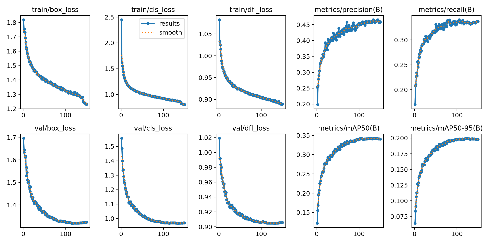
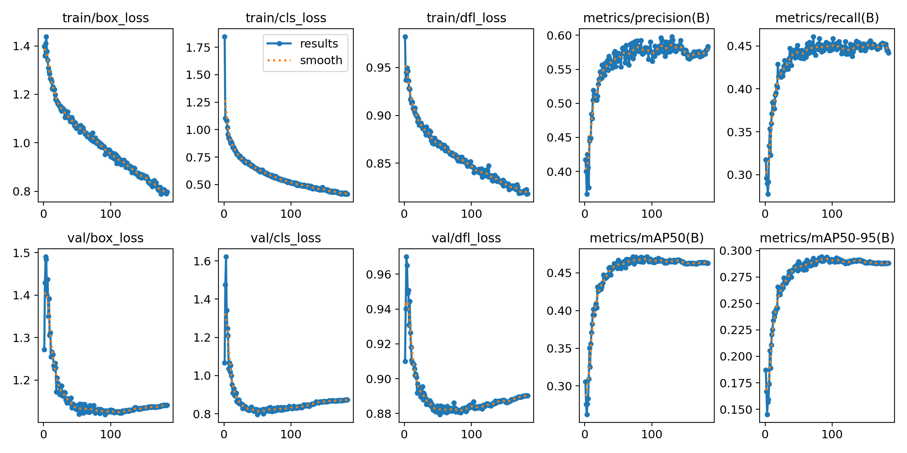
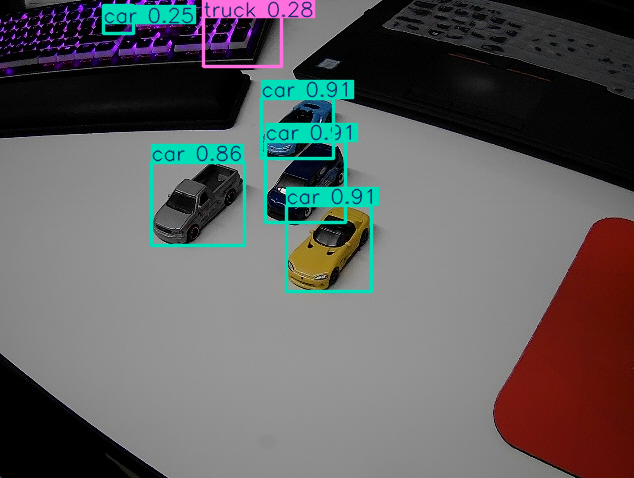
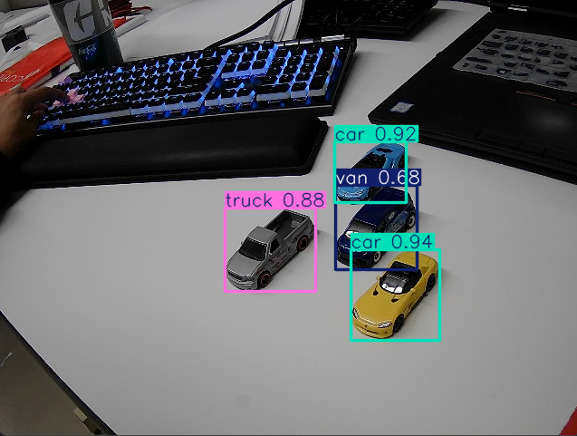
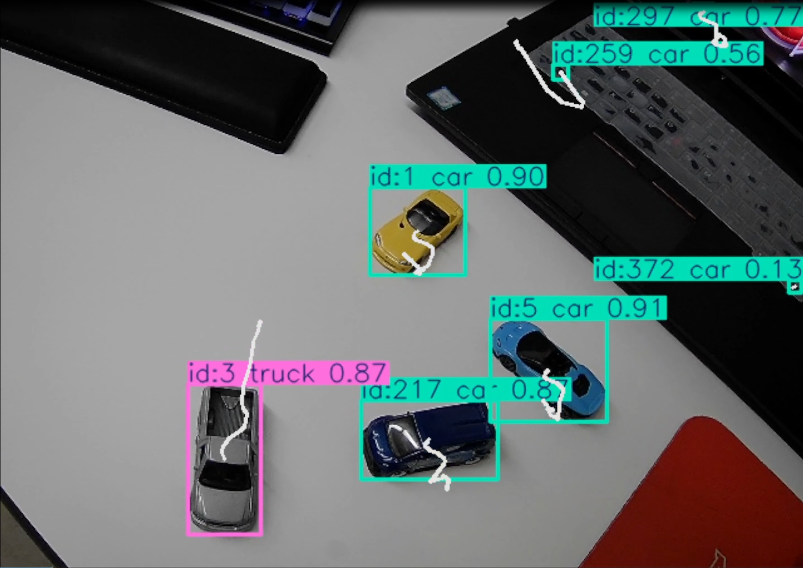
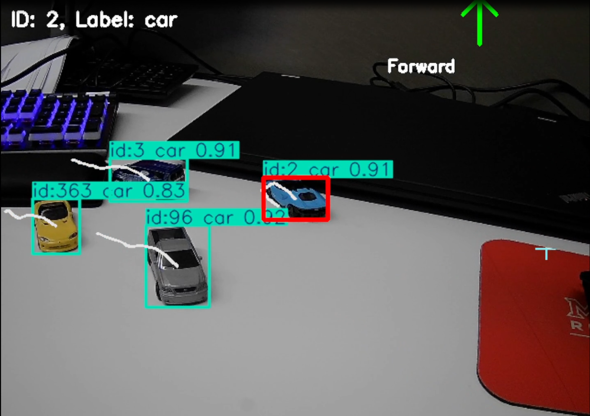
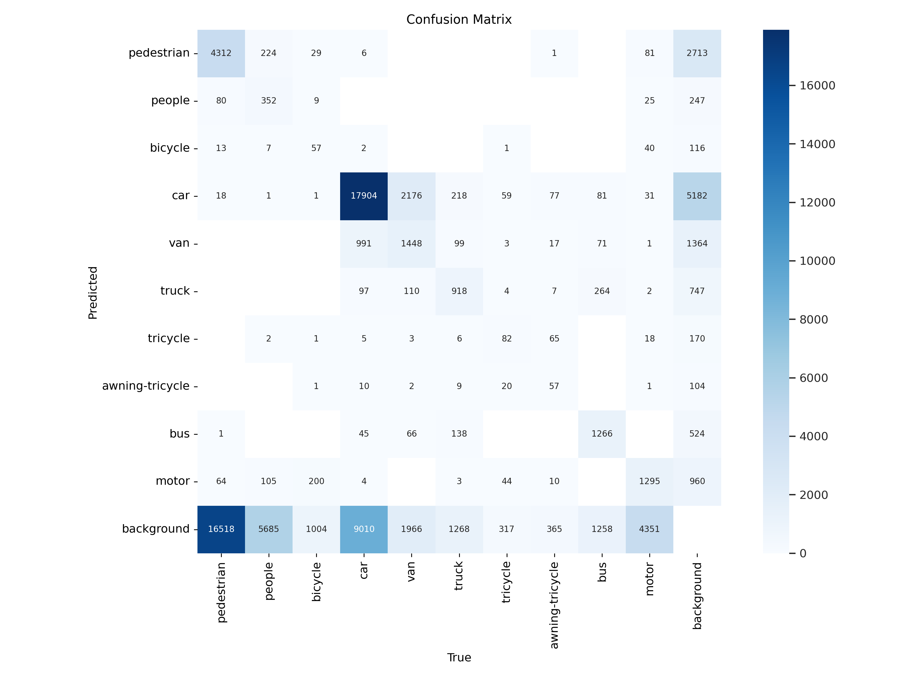
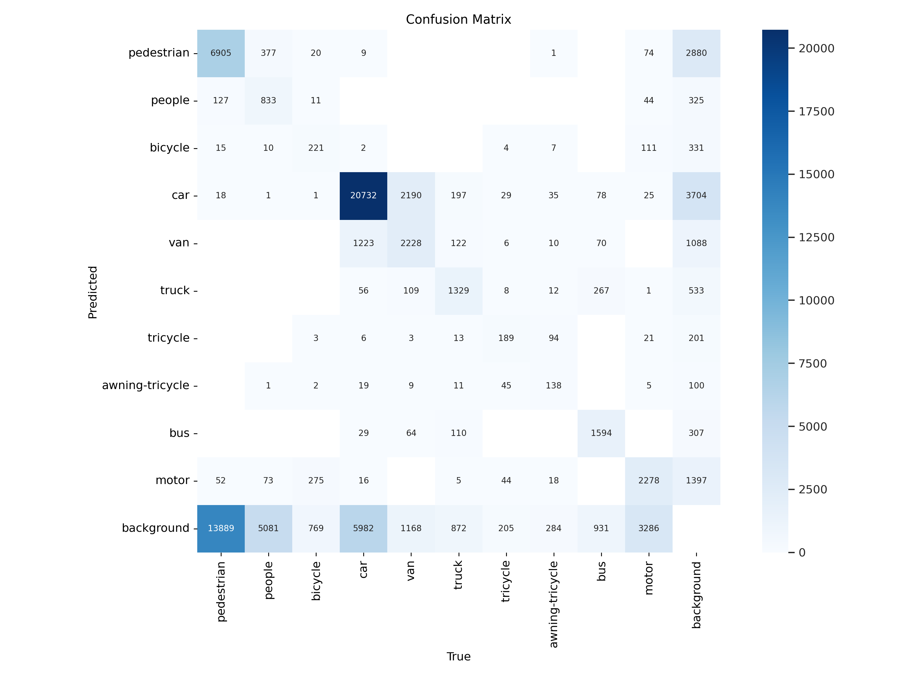

# Final Project: Exploring Object Detection Capabilities from UAV Aerial Perspectives with Deep Learning Tools

## 1. Introduction

Unmanned Aerial Vehicles (UAVs) are widely used in traffic monitoring, surveillance, and disaster relief. The challenges of accurate object detection from aerial imagery include varying object scales, cluttered environments, and altitude variations. Leveraging deep learning models like YOLO offers a promising solution for real-time object detection and tracking.

This project implemented **YOLO-based** systems to evaluate their performance on the **VisDrone dataset** and developed real-time detection capabilities using webcam inputs. A comparative analysis between YOLOv11n and YOLOv11x models was also conducted to optimize performance for aerial object detection.

---

## 2. Workflow Overview

1. **Dataset Preparation**:
   - Used the VisDrone dataset containing diverse UAV-captured imagery.
   - Configured a custom dataset YAML file for seamless training and validation.

2. **Model Selection and Comparison**:
   - Evaluated YOLOv11n for its lightweight and fast training characteristics.
   - Transitioned to YOLOv11x for improved accuracy on VisDrone-specific challenges.

3. **Hyperparameter Optimization**:
   - Explored various hyperparameters, including epochs, batch size, optimizer, and image resolution, to enhance performance.
   - Assessed performance through metrics like `val_loss`, `mAP50`, and `mAP50-95`.

4. **Real-time Detection**:
   - Developed real-time object detection using webcam inputs.
   - Extended functionality to include object tracking, movement trajectory, and directional guidance.

5. **Testing and Evaluation**:
   - Conducted tests with toy cars as objects to mimic UAV scenarios.
   - Used metrics and visual outputs (e.g., confusion matrix) to evaluate results.

---

## Challenges

### Challenge 1: Dataset Label Formatting

#### Problem:
The raw annotation files from the VisDrone dataset were not in a format compatible with YOLO. For example, the raw label format for the first line was as follows:

```txt
684,8,273,116,0,0,0,0
```
- The columns represent x_min, y_min, width, height, class_id, ... with no normalization.

- YOLO requires labels in the following format:

```txt
class_id center_x center_y width height
```
where all coordinates are normalized (scaled to the range `[0, 1]`).

#### Steps Taken:
- Developed a custom script to process the raw data:
- Calculated the normalized center coordinates and dimensions using the image size:
  ```python
  center_x = (x_min + width / 2) / image_width
  center_y = (y_min + height / 2) / image_height
  norm_width = width / image_width
  norm_height = height / image_height
  ```
- Converted the first line of the example into:
  ```
  0 0.7760416666666666 0.9027777777777778 0.07708333333333334 0.061111111111111116
  ```

#### Impact:
- The initial training process failed due to errors in label formatting.
- Debugging and reformatting ensured successful model training with a consistent dataset.

---

### Challenge 2: Tracking Issues and Code Modifications

#### Problem:
Using YOLO's official tracking code led to significant challenges:
- Severe frame drops occurred, making real-time tracking infeasible.
- Object trajectories reset frequently, resulting in inconsistent tracking and visualization.

#### Steps Taken:
- Analyzed and modified YOLO's tracking implementation:
1. **Optimized Object ID Persistence**:
   - Improved how object IDs were assigned and persisted across frames, especially during occlusions.
2. **Trajectory Visualization Fixes**:
   - Added a buffer to store recent positions of each object, ensuring smooth trajectory lines.
   - Fixed bugs that caused trajectories to reset unnecessarily.
3. **Reduced Computational Overhead**:
   - Removed redundant calculations and improved frame processing efficiency.

#### Impact:
- Frame rate improved significantly, enabling smooth real-time tracking.
- Object trajectories became consistent, accurately reflecting movement patterns.
- The optimized system maintained stable performance even with multiple objects.

---

### Challenge 3: Object Lock and Track in Real-Time Detection

#### Problem:
During the third phase of real-time detection, challenges arose with object locking and directional guidance:
1. **Mouse Input**:
 - Mouse clicks were detected but often failed to lock onto the correct object due to proximity matching issues.
2. **Locking Strategy**:
 - Initially, there was no effective method to center a locked object in the frame.

#### Steps Taken:
1. **Refined Mouse Input Logic**:
 - Adjusted proximity checks to ensure accurate matching between mouse clicks and tracked object positions.
 - Used the object's most recent position to determine if it was close to the click point.
2. **Implemented a Locking Strategy**:
 - Defined a "center region" in the frame based on the frame dimensions (e.g., 20% of the width and height).
 - Calculated offsets between the locked object's position and the center of the frame to provide directional guidance:
   ```python
   dx = x - center_x
   dy = center_y - y
   directions = []
   if abs(dx) > threshold:
       directions.append("Right" if dx > 0 else "Left")
   if abs(dy) > threshold:
       directions.append("Forward" if dy > 0 else "Backward")
   ```

#### Impact:
- Mouse clicks now accurately locked onto objects, and directional guidance helped users center objects in the frame.
- Added visual elements, such as arrows and labels, improved user interaction and usability.

---

## 3. VisDrone Dataset

The VisDrone dataset, developed by the AISKYEYE team at Tianjin University, serves as a benchmark for a wide range of vision tasks such as object detection, tracking, and segmentation.

- **Dataset Composition**:
  - Images: Contains over 10,209 static images and 288 video clips (261,908 frames).
  - Annotations: Includes over 2.6 million object instances with bounding boxes and attributes.
  - Classes: 10 object categories, including pedestrians, bicycles, cars, vans, trucks, buses, and others.

- **Key Challenges**:
  - High Variability: Significant size variation in objects due to aerial perspective.
  - Complexity: Intricate backgrounds and dense scenes complicate detection.
  - Imbalanced Classes: Limited samples of certain categories affect model performance.

---

## 4. YOLO Model Comparison

| Aspect            | YOLOv11n                     | YOLOv11x                        |
|--------------------|----------------------------------------------------------------------|------------------------------------------------------------------------------|
| Model Scale        | Smaller, designed for edge devices; fewer parameters (~4M).          | Largest in the YOLOv11 series, higher capacity with ~86M parameters.         |
| Depth and Width    | Shallower architecture with reduced feature extraction layers.       | Deeper architecture and wider feature maps, enabling richer feature capture. |
| Activation         | Uses LeakyReLU activation, which is computationally efficient.       | Incorporates Mish activation for smoother gradients and better performance.  |
| Anchor-Free Design | Limited flexibility in handling varying object scales.               | Improved anchor-free design with dynamic anchor assignment.                  |
| FPN and PAN Layers | Fewer layers, reducing feature aggregation efficiency.               | Enhanced FPN+PAN structure for multiscale feature fusion.                    |
| Prediction Layers  | Simplified, leading to faster inference but less robust predictions. | More prediction layers, improving generalization and localization accuracy.  |

### Performance Insights:

- YOLOv11n:
  - Box loss ≈ 1.3, Cls loss ≈ 0.9 after 150 epochs.
  - Suffered from overfitting.

- YOLOv11x:
  - Box loss ≈ 1.05, Cls loss ≈ 0.7 within just 50 epochs.
  - Superior convergence and accuracy.

**Figure 1**: Loss trends for YOLOv11n:  


**Figure 2**: Loss trends for YOLOv11x:  


---

## 5. Hyperparameter Optimization

Training Configurations:
- Epochs: Initial testing with 50 epochs, extended to 100 epochs for final tests.
- Batch Size: Ranged from 8 to 84, with 84 providing optimal results.
- Image Resolution: Tested resolutions from 640x640 to 720x720; 640x640 was chosen.
- Optimizers: Compared SGD, Adam, and AdamW. SGD provided stable results.

Key Findings:
- Larger batch size improved results until memory limits.
- SGD ensured stability and minimal overfitting.
- Higher resolution increased computational cost without significant accuracy gain.

---

## 6. Real-Time Object Detection Implementation

The real-time detection system was developed in three progressive stages, each adding complexity and functionality.

### 6.1. Basic Real-Time Object Detection

The foundation of the real-time detection system relied on the YOLO model and OpenCV for webcam integration.
   
- Libraries Used:
   -	Ultralytics YOLO: For pre-trained YOLOv11n and YOLOv11x models, enabling bounding box predictions and class probabilities.
   -	OpenCV: For accessing the webcam and displaying annotated frames.
- Principle:
   -	Each frame from the webcam is passed through the YOLO model.
   -	The YOLO model predicts bounding boxes, confidence scores, and class labels for detected objects.
   -	The output is visualized in real-time with bounding boxes and class labels overlaid on the frame.
- Key Implementation Details:
   -	YOLO's predict method is used to process webcam frames.
   -	Bounding boxes are drawn using the predicted coordinates, with class labels extracted from the YOLO model's outputs.
- Benefits:
   -	Fast and efficient detection suitable for real-time applications.
   -	Lightweight implementation without requiring complex tracking algorithms.

The following images compare the real-time detection performance of YOLOv11n and YOLOv11x:






### 6.2. Adding Object Tracking with Trajectory Visualization

To enhance the system, object tracking was introduced using a custom implementation combined with YOLO's track functionality.

- Libraries and Tools:
   -	Default YOLO Tracking: Utilized YOLO's built-in tracking capabilities, which assign unique IDs to objects across frames.
   -	Collections (Python): Used to store historical positions for trajectory visualization.
- Principle:
   -	The YOLO tracker assigns a persistent ID to each detected object.
   -	Historical positions of each object are stored and used to draw trajectories, visualizing the object's movement over time.
- How It Works:
   1.	Each detected object is assigned an ID by the YOLO tracker.
   2.	The center point of the bounding box is calculated for each object.
   3.	The coordinates are stored in a dictionary keyed by object IDs.
   4.	Historical positions are plotted as lines, showing movement trajectories.
- Advantages:
   -	Provides context for object movements, useful for applications like monitoring traffic patterns.
   -	Lightweight and efficient for simple trajectory visualization without significant computational overhead.
- Limitations:
   -	Basic tracking may lose object IDs during occlusion or fast movements.




### 6.3. Object Locking and Directional Guidance

Building upon the tracking system, object locking and directional guidance were implemented to allow interaction with specific objects.

- Interactive Features:
   -	Users can select an object by clicking near it on the displayed frame.
   -	Once selected, the system provides directional guidance (e.g., "Left," "Right") to align the selected object with the frame center.
- Key Concepts:
   -	Mouse Interaction:
   1.	Used OpenCV's setMouseCallback to capture mouse clicks.
   2.	Proximity checks determine if the click corresponds to a tracked object.
   -	Directional Guidance:
   1.	The frame center is treated as the "ideal position" for the locked object.
   2.	The offset between the object's position and the frame center determines the movement direction (e.g., "Left," "Up").
   3.	Directions are visualized with arrows and text.
- Challenges:
   -	Object locking requires consistent tracking IDs, which can be disrupted by occlusions.
   -	Handling frame-to-frame movement direction requires smoothing to avoid jitter.
- Future Improvements:
   -	Integrate DeepSORT to handle ID consistency and advanced trajectory prediction.



---

## 7. Evaluation

The system was evaluated using both quantitative metrics and qualitative observations:

- **Validation Loss and Metrics**:
  - YOLOv11n: Higher losses and poorer metrics.
  - YOLOv11x: Stable convergence and higher mAP scores.

- **Real-Time Testing**:
  - Conducted with a webcam and toy cars. Objects like car, van, and truck were consistently detected.
  - Observed occasional misclassification of truck due to dataset imbalance.

**Figure**: The confusion matrices below illustrate the performance comparison between YOLOv11n and YOLOv11x:





---

## 8. Future Work

1.	Accuracy Enhancements:
  - Explore 1D CNNs and advanced feature extraction methods.
  - Address dataset imbalance to improve truck classification.
2.	UAV Deployment:
  - Integrate the system with UAV hardware and evaluate under real-world conditions.
3.	Advanced Tracking:
  - Incorporate DeepSORT for more reliable multi-object tracking.

---

## 9. Conclusion

This project successfully developed a YOLO-based detection system capable of real-time object detection and tracking. YOLOv11x proved to be the superior model for the VisDrone dataset, achieving high accuracy and stable performance. The real-time system demonstrated promising results, forming a strong foundation for future UAV applications.

---

## References
- **VisDrone Dataset**: [VisDrone Official Site](github.com/VisDrone/VisDrone-Dataset)
- **Ultralytics YOLO**: [Ultralytics Official Site](docs.ultralytics.com/)
